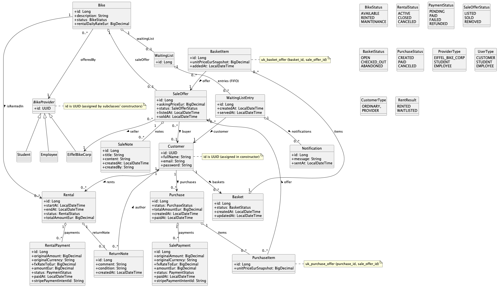

# Eiffel Bike Corp — Backend API Report


## Table of contents

* [Document control](#document-control)

* [1. Project description](#1-project-description)
  * [1.1 Context](#11-context)
  * [1.2 Objectives](#12-objectives)
  * [1.3 Functional scope](#13-functional-scope)
  * [1.4 Non-functional goals and constraints](#14-non-functional-goals-and-constraints)
  * [1.5 Technology overview (backend)](#15-technology-overview-backend)

* [2. Scope, assumptions, and glossary](#2-scope-assumptions-and-glossary)
  * [2.1 Scope](#21-scope)
  * [2.2 Assumptions](#22-assumptions)
  * [2.3 Glossary](#23-glossary)

* [3. Requirements mapping (User Stories → API → Domain Model)](#3-requirements-mapping-user-stories--api--domain-model)
  * [3.1 User stories (grouped)](#31-user-stories-grouped)
  * [3.2 Traceability matrix (US → REST API → Main domain objects)](#32-traceability-matrix-us--rest-api--main-domain-objects)
  * [3.3 Conceptual coverage and business-rule anchors in the domain model](#33-conceptual-coverage-and-business-rule-anchors-in-the-domain-model)
  * [3.4 Happy-path scenarios of use (backend perspective)](#34-happy-path-scenarios-of-use-backend-perspective)

* [4. Conceptual model](#4-conceptual-model)
  * [4.1 Domain overview](#41-domain-overview)
  * [4.2 Core actors and identities](#42-core-actors-and-identities)
  * [4.3 Rental subdomain](#43-rental-subdomain)
  * [4.4 Sale subdomain](#44-sale-subdomain)
  * [4.5 Payments and FX snapshot](#45-payments-and-fx-snapshot)
  * [4.6 Key invariants and constraints](#46-key-invariants-and-constraints)

* [5. Scenarios of use](#5-scenarios-of-use)
  * [S0 Authentication](#s0-authentication)
  * [S1 Offer a bike for rent (US_01–US_03)](#s1-offer-a-bike-for-rent-us_01us_03)
  * [S2 Search and rent / waiting list (US_04–US_07)](#s2-search-and-rent--waiting-list-us_04us_07)
  * [S3 Pay rental + return with notes (US_08–US_09)](#s3-pay-rental--return-with-notes-us_08us_09)
  * [S4 Corporate resale flow (US_10–US_19)](#s4-corporate-resale-flow-us_10us_19)
  * [S5 History (US_20–US_21)](#s5-history-us_20us_21)

* [6. API overview (endpoints, security, errors)](#6-api-overview-endpoints-security-errors)
  * [6.1 Base URLs, content type, Swagger UI](#61-base-urls-content-type-swagger-ui)
  * [6.2 Security model (Custom JAX-RS filter)](#62-security-model-custom-jax-rs-filter)
  * [6.3 Endpoint catalog by controller](#63-endpoint-catalog-by-controller)
  * [6.4 HTTP status codes and error behavior](#64-http-status-codes-and-error-behavior)
  * [6.5 CORS strategy (manual JAX-RS filter)](#65-cors-strategy-manual-jax-rs-filter)

* [7. Architecture and design](#7-architecture-and-design)
  * [7.1 Architectural overview](#71-architectural-overview)
  * [7.2 Layer responsibilities and flow (request lifecycle)](#72-layer-responsibilities-and-flow-request-lifecycle)
  * [7.3 Cross-cutting concerns](#73-cross-cutting-concerns)
  * [7.4 Design options and rationale (high-level)](#74-design-options-and-rationale-high-level)

* [8. Implementation notes and integrations](#8-implementation-notes-and-integrations)
  * [8.1 JAX-RS (Jersey) with Spring Boot](#81-jax-rs-jersey-with-spring-boot)
  * [8.2 Swagger / OpenAPI integration](#82-swagger--openapi-integration)
  * [8.3 Database integration (PostgreSQL)](#83-database-integration-postgresql)
  * [8.4 Docker integration](#84-docker-integration)
  * [8.5 Payment gateway integration (Stripe)](#85-payment-gateway-integration-stripe)
  * [8.6 Exchange-rate API integration (ExchangeRate-API)](#86-exchange-rate-api-integration-exchangerate-api)

* [9. Tests and validation](#9-tests-and-validation)
  * [9.1 Integration tests mapped to user stories](#91-integration-tests-mapped-to-user-stories)
  * [9.2 How to run the tests](#92-how-to-run-the-tests)
  * [9.3 Test data seeding and authentication strategy](#93-test-data-seeding-and-authentication-strategy)
  * [9.4 Coverage mapping (User Stories → tests → endpoints)](#94-coverage-mapping-user-stories--tests--endpoints)
  * [9.5 Examples of key scenarios covered](#95-examples-of-key-scenarios-covered)
  * [9.6 Notes / current limitations](#96-notes--current-limitations)

* [10. Frontend](#10-frontend)
  * [10.1 Route Configuration](#101-route-configuration)
  * [10.2 Security: Role Guard](#102-security-role-guard)
  * [10.3 Key Component Logic](#103-key-component-logic)
  * [10.4 UI/UX Implementation](#104-uiux-implementation)
  * [10.5 Integration Notes](#105-integration-notes)

* [11. Known limitations and future work](#11-known-limitations-and-future-work)
  * [11.1 Known limitations](#111-known-limitations)
  * [11.2 Future work (recommended improvements)](#112-future-work-recommended-improvements)

* [Appendix A — Runbook (commands and URLs)](#appendix-a--runbook-commands-and-urls)
* [Appendix B — Full endpoint reference](#appendix-b--full-endpoint-reference)
* [Appendix C — ADRs (Architecture Decision Records)](#appendix-c--adrs-architecture-decision-records)

* [References](#references)


## Document control

**Document title:** *Eiffel Bike Corp — Backend API Report*
**Project:** Eiffel Bike Corp (bike rental + corporate resale API)
**Scope:** Backend API
**Format:** Markdown

### Status

* **Status:** Draft
* **Team:** Marcos / Max / Pedro
* **Last updated:** 2025-12-26

### Versioning

| Version | Date (YYYY-MM-DD) | Author(s) | Changes                              |
|---------|------------------:| --------- |--------------------------------------|
| 0.1     |        2025-12-26 | Team      | Initial structure + backend overview |
| 0.2     |        2026-01-02 | Team      | Updates and corrections              |

### Audience

* Course instructors / reviewers
* Developers (backend)
* Testers / integrators (API consumers)

### Useful URLs (local dev)

* **API base URL:** `http://localhost:8080/api`
* **Swagger UI:** `http://localhost:8080/swagger-ui/index.html`

---

## 1. Project description

### 1.1 Context

Eiffel Bike Corp provides a **bike rental service inside Université Gustave Eiffel**, allowing **students and employees** to offer bikes for rent, and allowing customers (university members) to **search, rent, pay, and return** bikes. When a requested bike is unavailable, customers are placed on a **waiting list**, and they receive a **notification** when the bike becomes available.

In addition, the system supports a second business flow: EiffelBikeCorp can **sell corporate bikes** under controlled conditions (e.g., only bikes that have been rented at least once), enabling customers to browse offers, place items in a basket, check out, and pay.

### 1.2 Objectives

The backend API aims to:

* Expose a clear set of **REST endpoints** that map to the user stories.
* Provide a consistent **domain model** for rental + sale workflows.
* Ensure **fairness and correctness** in key flows:

    * waiting list (FIFO / first-come, first-served),
    * availability and state transitions (bike/rental/sale offer),
    * money consistency with **EUR as the system currency**.
* Provide production-like integrations:

    * **Stripe** for payment processing,
    * **ExchangeRate-API** for multi-currency conversion.
* Offer a complete, usable **API contract** via Swagger/OpenAPI.

### 1.3 Functional scope

Included:

* User registration and login (JWT-based authentication)
* Bike catalog and bike offering for rent
* Search rentable bikes
* Rent a bike or join the waiting list
* Notifications when bikes become available
* Pay rentals with currency conversion
* Return bikes with return notes
* Corporate resale: sale offers, sale notes, search offers, offer details/availability
* Basket management, checkout, purchase payment
* History endpoints (purchase history; rental history if enabled)

Not included (at this stage):

* Advanced admin/backoffice features
* Refund workflows and complex payment dispute handling
* Full observability stack (tracing, metrics dashboards), beyond basic logging

### 1.4 Non-functional goals and constraints

* **Technology constraint:** Java RS approach using **JAX-RS (Jersey)** hosted in **Spring Boot**
* **Persistence:** PostgreSQL with JPA/Hibernate mappings
* **Documentation:** Swagger/OpenAPI accessible via Swagger UI
* **Deployment support:** Docker for local reproducibility
* **MailHog:** SMTP delivery for test emails

### 1.5 Technology overview (backend)

* **Runtime:** Java (Spring Boot)
* **HTTP framework:** Jersey / JAX-RS
* **Persistence:** Spring Data JPA + Hibernate + PostgreSQL
* **API documentation:** Swagger OpenAPI (swagger-jaxrs2-jakarta + annotations)
* **Payment Gateway:** Stripe (`https://stripe.com/docs/api`)
* **FX conversion:** ExchangeRate-API (`https://www.exchangerate-api.com/docs/overview`)
* **Containerization:** Docker + Docker Compose

---

## 2. Scope, assumptions, and glossary

### 2.1 Scope

This section focuses **only on the backend API** of the Eiffel Bike Corp system.

Included in scope:

* REST endpoints implemented in the backend (JAX-RS/Jersey hosted in Spring Boot)
* DTO contracts (requests/responses) and status codes
* Domain model and business rules that enforce the user stories
* Authentication and authorization model (JWT bearer)
* Integrations:

    * PostgreSQL persistence
    * Docker Compose runtime (DB + optional app)
    * Swagger/OpenAPI documentation
    * Stripe payment processing
    * ExchangeRate-API currency conversion

Out of scope:

* Production deployment hardening (Kubernetes, CI/CD pipelines, secrets manager)
* Full monitoring/observability platform (metrics dashboards, distributed tracing)
* Refund and dispute management workflows (beyond basic payment status transitions)
* Performance benchmarking and load testing (can be added later)

---

### 2.2 Assumptions

The backend design and examples in this report assume:

1. **Environment assumptions**

* Local development uses:

    * `http://localhost:8080` for backend
    * PostgreSQL running via Docker on `localhost:5432`
* Swagger UI is reachable at:

    * `http://localhost:8080/swagger-ui/index.html`
  
* MailHog is reachable at:
    * `http://localhost:8025/`

2. **Security assumptions**

* Authentication is **JWT-based**.
* Secured endpoints expect:

    * `Authorization: Bearer <accessToken>`
* The token contains the user identifier (UUID) used to resolve the authenticated customer/provider in secured use cases.
* Four roles are defined:
  * ORDINARY : an ordinary user (CUSTOMER)
  * STUDENT : a student member of the university that offers bikes for rent
  * EMPLOYEE : an employee of the university that offers bikes for rent
  * EIFFEL_BIKE_CORP : a company that rents and sells bikes to customers


3. **Domain/business assumptions**

* Bikes have a lifecycle (e.g., `AVAILABLE`, `RENTED`, `MAINTENANCE`, `SOLD`).
* Rentals have a lifecycle (e.g., `ACTIVE`, `CLOSED`, `CANCELED`, `RESERVED`).
* Sale offers have a lifecycle (e.g., `LISTED`, `SOLD`, `REMOVED`).


* Waiting lists follow **FIFO** (“first come, first served”).
* EUR is the internal “system currency”; multi-currency payments are converted to EUR and stored with an FX snapshot.

4. **Integration assumptions**

* Stripe is reachable and configured through the application configuration.
* ExchangeRate-API calls succeed under normal conditions; a short cache may be used to reduce repeated calls.

---

### 2.3 Glossary

| Term               | Meaning                                                                                  |
|--------------------|------------------------------------------------------------------------------------------|
| API                | Application Programming Interface; here, the REST endpoints exposed by the backend       |
| JAX-RS / Java RS   | Java API for RESTful Web Services (Jakarta REST) used to implement controllers/resources |
| Jersey             | A reference implementation of JAX-RS used to run JAX-RS resources inside Spring Boot     |
| DTO                | Data Transfer Object; request/response models used at the API boundary                   |
| Provider           | Entity that offers bikes for rent (Student, Employee, EiffelBikeCorp)                    |
| Customer           | Entity that rents bikes and/or buys bikes                                                |
| Waiting list       | Queue for a bike when it is unavailable; serves customers in FIFO order                  |
| Notification       | Message emitted when a bike becomes available for a waiting customer                     |
| Basket             | Temporary container of sale offers selected by a customer before checkout                |
| Checkout           | Operation that converts a basket into a Purchase                                         |
| Purchase           | A record of items bought by a customer (result of checkout)                              |
| Payment gateway    | External provider processing card payments (Stripe)                                      |
| FX / Exchange rate | Conversion rate between currencies used to convert payments into EUR                     |
| FX snapshot        | Persisted exchange rate value used at payment time for audit and consistency             |
| Swagger UI         | Web UI that visualizes the OpenAPI contract and allows interactive API calls             |
| OpenAPI            | Specification for describing REST APIs (operations, schemas, auth, etc.)                 |
| JWT                | JSON Web Token used for stateless authentication                                         |
| MailHog            | Email-testing tool with a local SMTP server                                              |

---

## 3. Requirements mapping (User Stories → API → Domain Model)

This section links the functional requirements (user stories) to the REST API endpoints and the main domain objects that implement them. It also defines the main “happy-path” usage scenarios that will be referenced later in the user manual.

### 3.1 User stories (grouped)

The project requirements are expressed as user stories covering two phases: **rental inside the university** and **sale to the outside world**, with payments and currency conversion.

**A) Offering bikes for rent (Providers: Student, Employee, EiffelBikeCorp)**

* **US_01:** As Student, I want to offer my bike for rent so that other university members can rent it.
* **US_02:** As Employee, I want to offer my bike for rent so that other university members can rent it.
* **US_03:** As EiffelBikeCorp, I want to offer company bikes for rent so that customers can rent bikes even when no private bikes are available.

**B) Searching, renting, waiting list, notifications, paying, returning (Students, Employees)**

* **US_04:** As Student or Employee, I want to search for bikes available for rent so that I can quickly find a suitable bike.
* **US_05:** As Student or Employee, I want to rent a bike so that I can use it for my commute or daily needs.
* **US_06:** As Student or Employee, I want to be added to a waiting list when a bike is unavailable so that I can rent it as soon as it becomes available.
* **US_07:** As Student or Employee, I want to receive a notification when a bike becomes available so that I can rent it before someone else does.
* **US_08:** As Student or Employee, I want to pay the rental fee in any currency and have it converted to euros so that I can pay in my preferred currency while the system remains consistent.
* **US_09:** As Student or Employee, I want to add notes when returning a bike so that the next renter and the bike provider know the bike’s condition.

**C) Offering for sale (EiffelBikeCorp)**

* **US_10:** As EiffelBikeCorp, I want to list for sale only company bikes that have been rented at least once so that only used corporate bikes are eligible for resale.
* **US_11:** As EiffelBikeCorp, I want to offer bikes for sale with detailed notes so that buyers can assess each bike’s condition before purchasing.

**D) Shopping & paying (Customers )**

* **US_12:** As Customer, I want to search for bikes available to buy so that I can find a bike to purchase.
* **US_13:** As Customer, I want to view the sale price of bikes offered for sale so that I can compare options before buying.
* **US_14:** As Customer, I want to view the notes associated with bikes offered for sale so that I can make an informed buying decision.
* **US_15:** As Customer, I want to check whether a bike offered for sale is still available so that I don’t try to buy a sold or unavailable bike.
* **US_16:** As Customer, I want to add bikes offered for sale to a basket so that I can prepare my purchase before paying.
* **US_17:** As Customer, I want to remove bikes from my basket so that I can adjust my selection.
* **US_18:** As Customer, I want to purchase the bikes in my basket so that I can complete the transaction.
* **US_19:** As Customer, I want to pay for my purchase through a payment gateway so that the system can verify funds and complete the payment.

**E) History**

* **US_20:** As a Customer, I want to view my purchase history so that I can track what I bought and when.
* **US_21:** As a Customer, I want to view my rent history so that I can track what I rent and when.

---

### 3.2 Traceability matrix (US → REST API → Main domain objects)

| User Story                                                 | Main Endpoint(s)                                                                 | Key domain objects (conceptual model)                                                   |
| ---------------------------------------------------------- |----------------------------------------------------------------------------------| --------------------------------------------------------------------------------------- |
| US_01 / US_02 / US_03 Offer bike for rent                  | `POST /api/rent-offers`                                                          | `Bike` (offeredBy, rentalDailyRateEur, status) + `BikeProvider` (Student/Employee/Corp) |
| US_04 Search bikes to rent                                 | `GET /api/bikes?status=...&q=...&offeredById=...`                                | `Bike` (+ filters on status/description/provider)                                       |
| US_05 Rent a bike / US_06 Waitlist if unavailable          | `POST /api/rentals` (201 RENTED / 202 WAITLISTED)                                | `Rental` + `WaitingList` + `WaitingListEntry`                                           |
| US_06 View waitlist                                        | `GET /api/rentals/waitlist`                                                      | `WaitingListEntry` (+ customer + servedAt)                                              |
| US_07 Notifications                                        | `GET /api/rentals/notifications`                                                 | `WaitingListEntry.notifications` (notifications attached to waitlist entries)           |
| US_08 Pay rental (any currency → EUR)                      | `POST /api/payments/rentals`                                                     | `Rental` + `RentalPayment` (recorded per rental)                                        |
| US_09 Return bike + notes                                  | `POST /api/rentals/{rentalId}/return` and `GET /api/bikes/{bikeId}/return-notes` | `Rental.returnNote` (1 per rental)                                                      |
| US_10 Create sale offer (corp + rented at least once)      | `POST /api/sale-offers`                                                          | `SaleOffer` (seller=EiffelBikeCorp, bike, status) + uniqueness per bike                 |
| US_11 Add detailed sale notes                              | `POST /api/sale-offers/notes`                                                    | `SaleOffer.notes`                                                                       |
| US_12–US_15 Search + view details/availability/price/notes | `GET /api/sale-offers?q=...` and `GET /api/sale-offers/{saleOfferId}`            | `SaleOffer` (askingPriceEur, status, notes, buyer)                                      |
| US_16 Add to basket                                        | `GET /api/basket` and `POST /api/basket/items`                                   | `Basket` + `BasketItem(offer, priceSnapshot)`                                           |
| US_17 Remove from basket                                   | `DELETE /api/basket/items/{saleOfferId}`                                         | `BasketItem` unique per (basket, offer)                                                 |
| US_18 Checkout                                             | `POST /api/purchases/checkout`                                                   | `Purchase` + `PurchaseItem` created from basket                                         |
| US_19 Pay purchase                                         | `POST /api/payments/purchases`                                                   | `SalePayment` linked to `Purchase` (amountEur + fxRate + gateway id)                    |
| US_20 Purchase history                                     | `GET /api/purchases`                                                             | `Purchase` list by customer                                                             |
| US_21 Rental history                                       | `GET /api/rentals`                                                               | `Rental` list by customer                                                               |

---

### 3.3 Conceptual coverage and business-rule anchors in the domain model

A few domain modeling choices directly enforce requirements:

* **One waiting list per bike:** `Bike` owns a one-to-one `WaitingList`, and `WaitingList` enforces uniqueness on `bike_id`.
* **First-come, first-served waiting list:** `WaitingList.entries` are ordered by `createdAt ASC`, matching FIFO behavior at the persistence level.
* **One sale offer per bike:** `Bike.saleOffer` exists and `SaleOffer` has a unique constraint on `bike_id`.
* **Basket and purchase snapshots:** basket/purchase items store a `unitPriceEurSnapshot`, preventing price drift between adding to basket and checkout.
* **Payments store FX + EUR for consistency:** `SalePayment` stores `originalCurrency`, `fxRateToEur`, and `amountEur` (auditable conversion).

---

### 3.4 Happy-path scenarios of use (backend perspective)

These scenarios are the baseline flows used later in the user manual and test strategy.

**Scenario S1 — Offer a bike for rent (US_01/02/03)**

1. Provider calls `POST /api/rental-offers` with description + daily rate + provider identity.
2. System persists `Bike` with `status=AVAILABLE` and links it to the provider (`Bike.offeredBy`).

**Scenario S2 — Search and rent a bike (US_04 + US_05)**

1. Customer searches: `GET /api/bikes?status=AVAILABLE&q=...`
2. Customer rents: `POST /api/rentals` → response `201` with `result=RENTED`.

**Scenario S3 — Waitlist and notification (US_06 + US_07)**

1. Customer attempts to rent an unavailable bike: `POST /api/rentals` → response `202` with `result=WAITLISTED`.
2. Customer can consult the waitlist: `GET /api/rentals/waitlist`.
3. When a bike becomes available, notifications become visible via `GET /api/rentals/notifications`.

**Scenario S4 — Pay and return with notes (US_08 + US_09)**

1. Pay rental: `POST /api/payments/rentals` (any currency; stored consistently in EUR).
2. Return bike with notes: `POST /api/rentals/{rentalId}/return`.
3. View bike return-notes history: `GET /api/bikes/{bikeId}/return-notes`.

**Scenario S5 — Offer for sale, shop, check out, and pay (US_10–US_19)**

1. Corp lists bike: `POST /api/sale-offers` (rule documented in endpoint description).
2. Corp adds notes: `POST /api/sale-offers/notes`.
3. Customer searches: `GET /api/sale-offers?q=...` and opens details: `GET /api/sale-offers/{id}`.
4. Customer adds/removes from basket: `POST /api/basket/items`, `DELETE /api/basket/items/{saleOfferId}`.
5. Check out: `POST /api/purchases/checkout`.
6. Pay purchase: `POST /api/payments/purchases`.

**Scenario S6 — History (US_20 + US_21)**

* Purchase history: `GET /api/purchases`.
* Rental history: `GET /api/rentals`.

---

## 4. Conceptual model

This section describes the main domain concepts and their relationships that implement the user stories. The model is designed to enforce key business rules and invariants while supporting the required workflows.

Class Diagram: 

### 4.1 Domain overview

The backend is organized around two closely related subdomains:

1. **Rental subdomain** (university bike sharing)

* Providers (students, employees, EiffelBikeCorp) offer bikes for rent.
* Customers search bikes, rent them, and return them with notes.
* If a bike is not available, customers join a waiting list (FIFO) and receive notifications when the bike becomes available.

2. **Sale subdomain** (corporate resale)

* EiffelBikeCorp lists eligible corporate bikes for sale.
* Customers browse sale offers, view price and notes, add items to a basket, check out, and pay.
* Purchase history is available to customers.

Cross-cutting both subdomains:

* **Payments** (rental payments + purchase payments)
* **Currency conversion** using an external exchange-rate provider (store EUR + conversion snapshot)

The class diagram provides the conceptual entities and their relationships.

---

### 4.2 Core actors and identities

#### BikeProvider (abstract)

A provider is the “owner” offering bikes for rent. Providers are modeled via an abstract type with concrete specializations:

* **Student**
* **Employee**
* **EiffelBikeCorp**

This supports US_01–US_03 without duplicating the “offer bike” logic per role; the provider type becomes data and policy, not separate endpoint logic.

#### Customer

A **Customer** is the actor that rents bikes and buys bikes. Customers are linked to:

* Rentals
* Waiting list entries
* Purchases
* Basket

> IMPORTANT ARCHITECTURAL NOTE: ⚠️

This separation (Provider vs Customer) avoids ambiguity: a student/employee
can act as both a provider (offering a bike) and a customer (renting/buying)
through different aspects of their user profile, not duplicate accounts.
For simplicity reasons, each provider has a customer account registered with the same id, right in the moment of registration.
---

### 4.3 Rental subdomain

#### Bike

A **Bike** is the core object in the rental domain. It has:

* a **status** (availability lifecycle)
* a link to its **provider**
* a **daily rental price in EUR**

A bike can also be related to:

* **WaitingList** (for unavailable bikes)
* **SaleOffer** (if corporate and eligible for resale)

This single “Bike” entity supports both rental and resale flows while keeping the rental state machine explicit.

#### Rental

A **Rental** represents a time-bounded usage of a bike by a customer:

* links **Customer ↔ Bike**
* has timestamps (start/end)
* has a rental **status**
* has a computed **totalAmountEur**
* can have a single **ReturnNote**
* can have associated **RentalPayment** records

Rentals implement the core of US_05 (rent), US_09 (return + note), and support history queries (US_21).

#### ReturnNote

A **ReturnNote** captures condition information provided at return time:

* author (customer)
* comment/condition
* timestamp

Conceptually, it improves trust and bike quality transparency for future renters and providers (US_09).

#### WaitingList, WaitingListEntry, Notification

When a bike is unavailable, customers may join a **WaitingList** for that bike:

* Each bike has at most one waiting list.
* A waiting list contains ordered **WaitingListEntry** items.
* Notifications are linked to entries to record that a specific user was notified when availability changed.

This model supports:

* US_06 (waitlist join + later fulfillment)
* US_07 (notifications)
* fairness via FIFO ordering

---

### 4.4 Sale subdomain

#### SaleOffer

A **SaleOffer** represents a corporate bike offered for sale:

* links to exactly one **Bike**
* is owned/sold by **EiffelBikeCorp**
* has an asking price (EUR)
* has a sale lifecycle (listed/sold/removed)
* has zero or one buyer

`SaleOffer` is core for US_10 (eligibility to list) and enables US_12–US_15 (search/view/availability).

#### SaleNote

A **SaleNote** contains detailed condition notes attached to a sale offer (US_11, US_14).
This lets buyers judge a bike before purchasing.

#### Basket and BasketItem

A **Basket** belongs to one customer and represents a “pre-checkout” selection of sale offers.

* A basket contains **BasketItem** entries, each referencing a sale offer.
* Basket items store a **unitPriceEurSnapshot** to prevent price drift between browsing and checkout.

This directly supports US_16 and US_17.

#### Purchase and PurchaseItem

A **Purchase** is created during checkout:

* belongs to a customer
* contains purchase items (copied from basket)
* includes total amount in EUR
* has a status lifecycle (created/paid/canceled)

This supports US_18 (purchase/check out) and US_20 (purchase history).

---

### 4.5 Payments and FX snapshot

The system supports payments for:

* rentals (US_08)
* purchases (US_19)

To ensure **financial consistency**, the model stores:

* original payment amount and currency (e.g., USD)
* the **FX conversion rate** used at the time of payment
* the computed EUR amount stored in the system

This “FX snapshot” approach guarantees:

* stable totals in history views
* auditable conversions
* independence from later exchange-rate changes

The exchange-rate provider is treated as an integration component; its output is persisted as part of payment records (not recalculated later for history).

---

### 4.6 Key invariants and constraints

These are the conceptual rules enforced by the model and services:

* **A bike’s rental availability is driven by `BikeStatus`** and active rentals.
* **WaitingList is per-bike and FIFO:** entries are served in order.
* **SaleOffer is per-bike and only for eligible corporate bikes** (US_10).
* **Basket items and purchase items store price snapshots** (immutability of commercial facts).
* **Payments store FX snapshots** (immutability of financial facts).

---

## 5. Scenarios of use

**Prerequisite: Database seeding**
The application includes a `DatabaseSeeder` that runs automatically on startup (in non-test profiles). It initializes the database with a consistent state for demonstration:

*   **Alice (Student/Provider)**
  *   Email: `alice@bike.com`
  *   Password: `123456`
  *   State: She acts as both a provider and a customer using the same UUID. She has offered a bike ("Mountain Bike Rockrider") which is currently **AVAILABLE**. She also has an **ACTIVE** rental of a corporate bike ("Peugeot E-Bike City") and an open basket containing a sale offer.


*   **Bob (Customer)**
  *   Email: `bob@bike.com`
  *   Password: `123456`
  *   State: Bob is registered as a standard customer. In the initial seeded state, he is not part of any waiting list or active transaction.


*   **Alexa (Student/Provider)**
  *   Email: `alexa@bike.com`
  *   Password: `123456`
  *   State: She has a **CLOSED** rental history for Alice’s bike, including a return note stating the bike was returned without problems. She is also the seller associated with the "Vintage Road Bike 1980" sale offer in the database.


*   **Inventory**
  *   **1 corporate bike:** "Peugeot E-Bike City" (rented by Alice, status: **RENTED**).
  *   **1 student bike:** "Mountain Bike Rockrider" (offered by Alice, status: **AVAILABLE**).
  *   **1 corporate sale offer:** "Vintage Road Bike 1980" (status: **LISTED**, includes a sale note created by "Admin" regarding new brake installation).
---

### S0 Authentication

To perform any operation, you must first obtain a JWT.

**Step 0.1 — Login**
`POST /api/users/login`

```bash
curl -X POST http://localhost:8080/api/users/login \
  -H "Content-Type: application/json" \
  -d '{"email":"bob@bike.com","password":"123456"}'
```

**Result:**

* **200 OK**
* Returns a JSON object containing `accessToken`. Copy this token for subsequent requests.

---

### S1 Offer a bike for rent (US_01–US_03)

**Actor:** Alice (Student)  
**Goal:** Offer a personal bike for rent.

`POST /api/rental-offers`,

**Payload:**

```json
{
  "description": "Mountain Bike - Red",
  "offeredByType": "STUDENT",
  "offeredById": "<Alice-UUID-from-Token>",
  "rentalDailyRateEur": 5.00
}
```


**Result:**

* **201 Created**,
* The bike is now searchable with status **AVAILABLE**.

---

### S2 Search and rent / waiting list (US_04–US_07)

### S2 Search and rent / waiting list (US_04–US_07)

**Actor:** Bob (Student)

**Step S2.1 — Search**
`GET /api/bikes?status=AVAILABLE`

* **Result:** Bob sees Alice’s “Mountain Bike Rockrider”.

**Step S2.2 — Rent**
`POST /api/rentals`

**Payload:**

```json
{
  "bikeId": 1,
  "customerId": "<Bob-UUID>",
  "days": 3
}
```

**Outcome A (bike available):**

* **201 Created**
* Response: `{"result": "RENTED", "rentalId": 55, "waitingListEntryId": null, "message": "Bike rented successfully."}`

**Outcome B (bike unavailable):**

* **202 Accepted**
* Response: `{"result": "WAITLISTED", "rentalId": null, "waitingListEntryId": 10, "message": "Bike not available. You have been added to the waiting list."}`
---

### S3 Pay rental + return with notes (US_08–US_09)

### S3 Payment and return (US_08, US_09)

**Actor:** Bob (Student)

**Step S3.1 — Pay rental (US_08)**
`POST /api/payments/rentals`

**Payload:**

```json
{
  "rentalId": 55,
  "amount": 16.50,
  "currency": "USD",
  "paymentMethodId": "pm_card_visa"
}
```

* **Result:** `201 Created`.
* **Details:** The system converts the `USD` amount to `EUR` using a real-time exchange rate and persists an FX snapshot (original amount, currency, rate, and final EUR) to ensure historical consistency.

**Step S3.2 — Return bike (US_09)**
`POST /api/rentals/55/return`

**Payload:**

```json
{
  "authorCustomerId": "<Bob-UUID>",
  "comment": "Brakes feel a bit loose",
  "condition": "GOOD"
}
```

* **Result:** `200 OK`.
* **Outcome:**
  * The rental status is set to `CLOSED`.
  * A `ReturnNote` is created with Bob's feedback.
  * The bike status becomes `AVAILABLE` (briefly).
  * **Automatic FIFO processing:** If a waiting list exists, the system automatically creates a new `RESERVED` rental for the next person in line and sends them a notification.

### S4 Corporate resale flow (US_10–US_19)

**Actor:** Bob (Customer)

**Step S4.1 — Browse sales**
`GET /api/sale-offers`

* Returns the “Vintage Road Bike” seeded by the corporation.

**Step S4.2 — Add to basket**
`POST /api/basket/items` with `saleOfferId`.

**Step S4.3 — Check out**
`POST /api/purchases/checkout`

* Converts the basket into a `Purchase` with status `CREATED`. Price snapshots are locked.

**Step S4.4 — Pay purchase**
`POST /api/payments/purchases`

* Integrates with Stripe. On success, the purchase status becomes `PAID` and the sale offer becomes `SOLD`.

---

### S5 History (US_20–US_21)

**Step S5.1 — Purchase history**
`GET /api/purchases`

* Lists all purchases made by the logged-in user.

**Step S5.2 — Rental history**
`GET /api/rentals`

* Lists all past and active rentals for the logged-in user.

---

## 6. API overview (endpoints, security, errors)

### 6.1 Base URLs, content type, Swagger UI

**Backend base URL (dev):**

* `http://localhost:8080/api`

All controllers produce/consume JSON (`application/json`). For example, `/users` is explicitly JSON in `UserController`.

**Swagger UI (dev):**

* `http://localhost:8080/swagger-ui/index.html`

Swagger is used to expose and explore endpoints interactively (especially useful for validating request/response payloads and testing authenticated calls).

---

### 6.2 Security model (Custom JAX-RS filter)

### Security Layer Implementation

Instead of using the heavyweight Spring Security filter chain, the application implements a lightweight, custom security layer using standard JAX-RS components:

*   **Token service:** A custom `TokenService` handles the generation and validation of JSON Web Tokens (JWT). It generates tokens that include the user's identity and type, returning an `accessToken` with a specified expiration.
*   **Authentication filter:** A JAX-RS `@Provider` named `AuthFilter` acts as a `ContainerRequestFilter`. It is registered in the `JerseyConfiguration` and intercepts requests to endpoints protected by the `@Secured` annotation.
  *   It validates the **`Authorization: Bearer <token>`** header using the `TokenService`.
  *   Upon successful validation, it injects the **`userId` (UUID)** into the `ContainerRequestContext` properties.
*   **Role-Based Authorization:** The system enforces fine-grained access control using the standard `@RolesAllowed` annotation on resource methods.
  *   The `RolesAllowedDynamicFeature` is registered in the `JerseyConfiguration` to enable this functionality.
  *   Access is restricted based on user types defined in the system: **`STUDENT`**, **`EMPLOYEE`**, **`EIFFEL_BIKE_CORP`**, and **`ORDINARY`** (standard customers).
  *   For example, only `STUDENT` and `EMPLOYEE` roles can access rental waiting lists and notifications.
*   **Password hashing:** User passwords are not stored in plain text. They are hashed using the **SHA-256** algorithm via `SecurityUtils.hashSHA256` during both registration and login processes.
---

### 6.3 Endpoint catalog by controller

Below is the **functional** endpoint list, grouped by controller. (All paths are relative to `/api`.)

#### 6.3.1 Users (`/users`)

* `POST /users/register` — Register a new user (Student, Employee, etc.).
* `POST /users/login` — Login with credentials, returns a JWT `accessToken`.

#### 6.3.2 Rental Offers (`/rental-offers`)

* `POST /rental-offers` — Offer a personal or corporate bike for rent (US_01–US_03).

#### 6.3.3 Bikes (`/bikes`)

* `GET /bikes?status=&q=&offeredById=` — Search bikes available to rent (US_04). Supports filtering by status (`AVAILABLE`), description keywords, or provider UUID.
* `PUT /bikes/{bikeId}` — Update a bike's description, status, or rental rate.
* `GET /bikes/all` — List all bikes regardless of status (admin/test utility endpoint).
* `GET /bikes/{bikeId}/return-notes` — View the history of return notes for a specific bike to assess its condition (US_09 context).

#### 6.3.4 Rentals (`/rentals`)

All endpoints in this controller rely on the authenticated user’s identity extracted securely from the JWT. The `userId` is obtained from the security context, preventing users from accessing or modifying rentals that do not belong to them.

* `POST /rentals` — Rent a bike or join the waiting list (US_05–US_06).
  * Returns **201 Created** (`RentResult.RENTED`) if successful.
  * Returns **202 Accepted** (`RentResult.WAITLISTED`) if the bike is unavailable.
* `POST /rentals/{rentalId}/return` — Return a bike and optionally add a condition note (US_09). This action triggers the “serve next” logic for the waiting list.
* `GET /rentals/active` — List the authenticated user’s currently active rentals.
* `GET /rentals/active/bikes` — Retrieve a list of bike IDs currently rented by the authenticated user.
* `GET /rentals/waitlist` — View the authenticated user’s current status in waiting lists (US_06).
* `GET /rentals/notifications` — View notifications regarding bike availability for the authenticated user (US_07).
* `GET /rentals` — View the complete rental history for the authenticated user (US_21).

#### 6.3.5 Sale Offers (`/sale-offers`)

* `POST /sale-offers` — Create a sale offer (US_10). Only corporate bikes rented at least once can be listed by EiffelBikeCorp.
* `POST /sale-offers/notes` — Add a detailed sale note to an offer to help buyers assess condition (US_11).
* `GET /sale-offers?q=` — Search available sale offers using keywords (US_12).
* `GET /sale-offers/{saleOfferId}` — Get full details of a sale offer, including price, historical notes, and availability (US_13–US_15).
* `GET /sale-offers/by-bike/{bikeId}` — Resolve and retrieve sale offer details specifically by the bike's ID.

#### 6.3.6 Basket (`/basket`)

* `GET /basket` — get (or create) my open basket
* `POST /basket/items` — add sale offer to basket (US_16)
* `DELETE /basket/items/{saleOfferId}` — remove from basket (US_17)
* `DELETE /basket` — clear basket

#### 6.3.7 Purchases (`/purchases`)

* `POST /purchases/checkout` — convert open basket into a purchase (US_18)
* `GET /purchases` — purchase history (US_20)
* `GET /purchases/{purchaseId}` — purchase details

#### 6.3.8 Payments (`/payments`)

* `POST /payments/rentals` — pay rental, supports currency conversion (US_08)
* `POST /payments/purchases` — pay purchase through gateway (US_19)

---

### 6.4 HTTP status codes and error behavior

The controllers follow clear HTTP semantics:

* **200 OK** — successful reads, updates, and “OK” commands (e.g., basket modifications).
* **201 Created** — resource created:

    * offering bikes for rent
    * rental payment created
    * checkout creates a purchase
* **202 Accepted** — request accepted but not completed as “RENTED” (join waiting list scenario).
* **400 Bad Request** — validation / missing required data (e.g., invalid payload or missing customerId in older variants).
* **401 Unauthorized** — missing/invalid token; some controllers throw `WebApplicationException("Unauthorized", 401)` if no userId is in context.
* **403 Forbidden** — role-based access control violation (e.g., only corp can create sale offers), enforced via `@RolesAllowed`.
* **404 Not Found** — referenced entity not found (bike, offer, rental, purchase), documented in Swagger annotations.
* **409 Conflict** — business rule violation (e.g., offer not available, invalid state, already paid), documented in multiple controllers.

---

### 6.5 CORS strategy (manual JAX-RS filter)

Cross-Origin Resource Sharing (CORS) is managed through a dedicated JAX-RS `ContainerResponseFilter` rather than Spring’s `@CrossOrigin` annotations. This ensures consistent behavior across all JAX-RS resources.

* **Implementation:** The class `CorsFilter` is registered as a `@Provider`.
* **Allowed origin:** Explicitly set to `http://localhost:4200` to support the Angular frontend development server.
* **Preflight handling:** The filter detects HTTP `OPTIONS` requests and immediately sets the response status to `200 OK`, ensuring browsers receive the necessary permission headers before attempting actual data-modifying requests (POST, PUT, DELETE).
* **Headers injected:**

    * `Access-Control-Allow-Origin: http://localhost:4200`
    * `Access-Control-Allow-Credentials: true` (allows sending cookies/auth headers)
    * `Access-Control-Allow-Methods: GET, POST, PUT, DELETE, OPTIONS, HEAD`
    * `Access-Control-Allow-Headers: origin, content-type, accept, authorization`

---

## 7. Architecture and design

### 7.1 Architectural overview

The backend follows a **layered architecture** with a clear separation of concerns, ensuring maintainability and scalability:

### 1. API Layer (Controllers / Resources)
*   **Implementation:** Implemented as **JAX-RS resources** using Jersey, registered within a `JerseyConfiguration`.
*   **Responsibilities:**
  *   **HTTP Routing & Content Negotiation:** Managing endpoints via `@Path`, `@Produces`, and `@Consumes` (exclusively `application/json`).
  *   **Input Validation:** Enforcing constraints on request DTOs using `@Valid` and Jakarta Validation.
  *   **Security Context:** Extracting the authenticated `userId` from the `ContainerRequestContext` via a common `BaseController`.
  *   **Status Code & Error Mapping:** Leveraging a suite of **Exception Mappers** to transform business exceptions into standardized HTTP responses (e.g., 400, 401, 404, 409).

### 2. Application/Use-Case Layer (Services)
*   **Implementation:** Spring-managed `@Service` components that encapsulate complex workflows.
*   **Business Logic:**
  *   **Rental Management:** Orchestrating the **rent vs. waitlist** decision (US_05/US_06) and implementing the **FIFO (First-In, First-Out)** principle for the waiting list.
  *   **Automated Transitions:** Handling the return flow (US_09), which automatically triggers notifications and creates "RESERVED" rentals for the next user in line.
  *   **Sales Compliance:** Enforcing the rule that EiffelBikeCorp can only list corporate bikes for sale if they have been **rented at least once** (US_10).
  *   **Asynchronous Tasks:** Sending email notifications when a user is added to a waiting list or when a bike becomes available.

### 3. Domain Layer (Entities + Enums)
*   **Implementation:** Domain models using JPA/Hibernate entities and Enums.
*   **Core Concepts:**
  *   **Entities:** `Bike`, `Rental`, `SaleOffer`, `Basket`, `Purchase`, `WaitingList`, and `Payment` variants.
  *   **State Enums:** Defining lifecycle states through `BikeStatus` (AVAILABLE, RENTED, etc.), `RentalStatus`, `PurchaseStatus`, and `PaymentStatus`.
  *   **Integrity:** Using persistence constraints like **Unique Constraints** (e.g., one sale offer per bike) and **Inheritance Mapping** (Joined strategy) for `BikeProvider` types like Student and Employee.

### 4. Infrastructure Layer (Persistence + Integrations)
*   **Persistence:** PostgreSQL database managed through Spring Data JPA repositories.
*   **External Integrations:**
  *   **Payment Gateway:** Stripe integration for authorizing and capturing payments.
  *   **Currency Conversion:** A dedicated `FxRateService` using an external **Exchange-Rate API** to fetch real-time rates for US_08 and US_19.
  *   **Documentation:** Automatic **OpenAPI/Swagger** generation via `OpenApiResource` for interactive API exploration.
  *   **Cross-Origin Support:** A `CorsFilter` configured to allow communication with the Angular frontend at `localhost:4200`.
---

### 7.2 Layer responsibilities and flow (request lifecycle)

A typical request follows this lifecycle:

1. **HTTP request enters a JAX-RS resource**
   Example: `POST /api/rentals` hits `RentalController`.

2. **Security is enforced (if endpoint is protected)**

* Many controllers are annotated with `@Secured`.
* A security filter/interceptor validates the JWT and injects `userId` into the `ContainerRequestContext`.

3. **Controller retrieves the current user from request context**
   Controllers use a helper like:

* `requestContext.getProperty("userId")`
  If missing, they throw 401 Unauthorized.

4. **Controller delegates to a service**
   Controllers remain thin: they orchestrate HTTP semantics and call service methods that implement the business behavior.

5. **Service loads entities / applies business rules**

* Repository queries load bikes/rentals/offers/baskets/purchases.
* Business rules decide:

    * rent vs waitlist (US_05/US_06)
    * sale eligibility (US_10)
    * payment admissibility (not already paid, correct state, etc.)

6. **Service calls integrations when needed**

* Stripe for payment processing (payments endpoints)
* Exchange-rate API for currency conversion (US_08/US_19)

7. **Controller returns a DTO response with HTTP status**

* `201 Created` for created resources
* `202 Accepted` for waitlist outcomes
* `200 OK` for reads/updates

---

### 7.3 Cross-cutting concerns

#### 7.3.1 Security design

* **Stateless architecture:** The system relies entirely on **JSON Web Tokens (JWT)** for authentication; no server-side sessions are stored. This aligns with the REST architectural style, ensuring scalability and statelessness.
* **JAX-RS-native implementation:** Security is implemented via a `ContainerRequestFilter` (`AuthFilter`) registered in the `JerseyConfiguration`. This maintains a lightweight architecture using standard JAX-RS components, complemented by the `RolesAllowedDynamicFeature` to enable role-based access control via `@RolesAllowed`.
* **Context-based identity:** Controllers do not trust user-provided IDs in request bodies for sensitive operations. Instead, the `BaseController` retrieves the authenticated user's UUID directly from the security context property injected by the filter:

```java
Object v = requestContext.getProperty("userId");
if (v instanceof UUID id) return id;
```

#### 7.3.2 Validation and Error Handling

* **Bean Validation:** Request bodies are strictly validated using Jakarta Bean Validation (`@Valid`). Constraints such as `@NotNull`, `@NotBlank`, and `@DecimalMin` are enforced on DTOs, with the `ValidationFeature` registered in the API configuration.
* **Standardized Responses:** The application uses a suite of **Exception Mappers** (e.g., `BusinessRuleExceptionMapper`, `NotFoundExceptionMapper`, `AuthenticationExceptionMapper`) to catch business logic violations and validation errors, converting them into consistent JSON error payloads with appropriate HTTP status codes (400, 401, 404, 409).

#### 7.3.3 Consistent money handling

* **EUR as Internal Currency:** The system uses **EUR** as the base currency for all internal consistency and persistence. Domain entities like `Bike`, `Rental`, and `SaleOffer` store rates and prices in EUR to prevent rounding discrepancies across the platform.
* **Multi-currency Support:** Payments (US_08, US_19) accept any currency. The `PaymentServiceImpl` uses an `FxRateService` to fetch real-time exchange rates and convert the amount to EUR before processing the transaction through the payment gateway.
* **Auditability:** To support stable history views and audit trails, the `RentalPayment` and `SalePayment` entities persist a snapshot of the conversion:
  * **Original amount/currency:** The values provided by the user (e.g., USD, BRL).
  * **FX rate used:** The specific exchange rate applied at the moment of the transaction.
  * **EUR result:** The final converted amount stored in the system's base currency.

#### 7.3.4 State machines

The design relies on explicit states (enums) for consistency across the business logic:

*   **Bike availability:** `AVAILABLE`, `RENTED`, `MAINTENANCE`, and `SOLD`.
*   **Rental lifecycle:** `ACTIVE`, `CLOSED`, `CANCELED`, and `RESERVED` (used for the auto-rent feature from waiting lists).
*   **Sale offer lifecycle:** `LISTED`, `SOLD`, and `REMOVED`.
*   **Payment lifecycle:** `PENDING`, `PAID`, `FAILED`, and `REFUNDED`.
*   **Purchase lifecycle:** `CREATED`, `PAID`, and `CANCELED`.
*   **Basket lifecycle:** `OPEN`, `CHECKED_OUT`, and `ABANDONED`.

This reduces ambiguity, ensuring that business rules—such as preventing the sale of a bike that isn't `LISTED` or paying for a rental that isn't `ACTIVE`—are strictly enforceable.

---

### 7.4 Design options and rationale (high-level)

The following design decisions shape the backend:

1.  **JAX-RS (Jersey) instead of Spring MVC:** This was chosen to strictly adhere to the "Java RS" project requirement while maintaining a standard RESTful style through `ResourceConfig`.
2.  **Use-case-oriented endpoints:** The API is designed around user intent rather than simple CRUD. For example, `POST /rentals` manages the complexity of either creating a rental (**201 Created**) or joining a waiting list (**202 Accepted**) based on real-time availability.
3.  **Store snapshots for commercial facts:** To maintain auditability and protect against price or exchange rate fluctuations:
  *   **Price snapshots:** `BasketItem` and `PurchaseItem` store the `unitPriceEurSnapshot` at the moment of addition or checkout.
  *   **Currency snapshots:** Payment entities store the `fxRateToEur` used during the transaction, ensuring historical records remain accurate regardless of future rate changes.
4.  **Request-context identity (`userId`):** Sensitive operations derive the user's identity from the secure JWT context via `BaseController`. This prevents "ID spoofing" where a user might try to perform actions (like clearing a basket or returning a bike) on behalf of another user by simply changing a ID in the request body.
5.  **Automated FIFO Waiting List:** The system implements a "first come, first served" principle. When a bike is returned, the service automatically transitions the next person in the `WaitingList` to a `RESERVED` rental and triggers an asynchronous notification, fulfilling US_06 and US_07 without manual intervention.
---


## 8. Implementation notes and integrations

> Note: configuration snippets below are described at a high level. For exact values, refer to the repository configuration files (`application.properties`, `compose.yaml`, `pom.xml`, Dockerfiles, etc.).

---

### 8.1 JAX-RS (Jersey) with Spring Boot

**Configuration:**
The application is configured using `JerseyConfiguration.java`, which extends `ResourceConfig` and is marked with `@Configuration` and `@ApplicationPath("/api")`. This class explicitly registers the components required for the REST API:

*   **Resources:** Scans the `fr.eiffelbikecorp.bikeapi.controller` package for JAX-RS resources.
*   **Validation:** Registers the `ValidationFeature` to enable Jakarta Bean Validation (`@Valid`) on request DTOs.
*   **Security & Authorization:** Registers the `AuthFilter` for JWT validation and the `RolesAllowedDynamicFeature` to enable role-based access control via `@RolesAllowed`.
*   **Filters:** Registers a custom `CorsFilter` to manage Cross-Origin Resource Sharing and preflight `OPTIONS` requests.
*   **Exception Mappers:** Registers a comprehensive suite of mappers to translate business and system exceptions into standardized JSON responses:
  *   `NotFoundExceptionMapper` (404).
  *   `BusinessRuleExceptionMapper` (409 Conflict).
  *   `BadRequestExceptionMapper` (400).
  *   `AuthenticationExceptionMapper` (401).
  *   `ForbiddenExceptionMapper` (403).
  *   `GenericExceptionMapper` (500).
*   **OpenAPI:** Registers `OpenApiResource` and `SwaggerSerializers` to generate and serve Swagger documentation at runtime.

---

### 8.2 External Integrations

**Payment Gateway (Stripe):**
The system integrates with **Stripe** to handle secure payments. The `StripeProperties` class manages the `secretKey` and default currency, initializing the Stripe SDK upon application startup. It is used for both rental fees (US_08) and bike purchases (US_19).

**Real-time Currency Conversion:**
To support US_08 and US_19, the application uses an external **Exchange-Rate API**.
*   **Configuration:** `ExchangeRateApiProperties` stores the API key and base URL.
*   **Logic:** The system fetches real-time rates (defaulting to a EUR base) to convert user payments into the internal consistency currency.

---

### 8.3 Data Seeding and Demonstration

**Automated Seeding:**
To fulfill the requirement for a basic scenario with minimal user intervention, the application includes a `DatabaseSeeder`.
*   **Execution:** Runs on startup (excluding the `test` profile) via `CommandLineRunner`.
*   **Scenario Coverage:** It populates the database with:
  *   **Users & Providers:** Creates a Student Provider (Alice), a Standard Customer (Bob), and the EiffelBikeCorp admin, ensuring they have the necessary shared UUIDs across `Customer` and `BikeProvider` tables.
  *   **Inventory:** Seeds bikes with different statuses, including a "Mountain Bike" available for rent and a "Vintage Road Bike" listed for sale.
  *   **Transactions:** Generates historical data, including an active rental for Alice and a past rental for Alexa with a return note, demonstrating the condition history logic (US_09).
  *   **Commercial State:** Sets up an open basket for Alice containing a sale offer, ready for checkout testing (US_16).


### 8.4 Swagger / OpenAPI integration

#### Goal
Provide a **self-service API contract** to facilitate:
* **Endpoint discovery:** Mapping all available resources under the `/api` path.
* **Schema documentation:** Defining request and response DTOs, including validation constraints.
* **Interactive testing:** Allowing direct execution of API calls within the browser with built-in JWT authorization support.

#### Implementation approach
The project integrates Swagger/OpenAPI specifically for JAX-RS by registering the necessary components in `JerseyConfiguration`.
* **Registration:** The application registers `OpenApiResource` and `SwaggerSerializers` to generate and serve the API definition.
* **Metadata:** The `OpenApiConfig` class defines the API title ("EiffelBikeCorp Bike API"), version (1.0.0), and the local server URL.
* **Security Definition:** A global `SecurityScheme` named **"bearerAuth"** is declared as an HTTP Bearer/JWT scheme, allowing the UI to pass tokens in the `Authorization` header.
* **Controller Annotations:**
  * **`@Tag`**: Groups resources by domain (e.g., "Bikes", "Rentals", "Sales").
  * **`@Operation`**: Provides a summary and description linked to specific user stories.
  * **`@ApiResponses`**: Clearly documents potential status codes, such as **201 Created** (RENTED) vs **202 Accepted** (WAITLISTED) in the rental flow.
  * **`@SecurityRequirement`**: Injected at the controller or method level to specify which endpoints require the "bearerAuth" token.
* **DTO Annotations:** Request objects use **`@Schema`** to provide field descriptions and usage examples, such as the Stripe `paymentMethodId`.

#### Access
The interactive documentation is available at:
* `http://localhost:8080/swagger-ui/index.html`

This integration is essential for documenting the complex business rules of the API, especially where multiple DTOs and diverse HTTP status outcomes are used to satisfy requirements like the FIFO waiting list (US_06) or currency conversion (US_08).


### 8.5 Database integration (PostgreSQL)

#### What is stored

PostgreSQL stores the entire persistent business state through a relational schema:

*   **Bike Catalog & Statuses:** Central `Bike` entities with descriptions, daily rental rates, and life-cycle states (AVAILABLE, RENTED, MAINTENANCE, SOLD).
*   **Rentals & History:** `Rental` records linking customers to bikes, including start/end timestamps and return condition metadata via `ReturnNote`.
*   **Waiting Lists & Notifications:** A `WaitingList` for each bike manages a queue of `WaitingListEntry` records, which trigger persistent `Notification` messages for users.
*   **Commercial State:** `Basket` and `Purchase` entities with their respective line items (`BasketItem`, `PurchaseItem`), which store price snapshots to ensure consistency.
*   **Payments & Audit Trails:** `RentalPayment` and `SalePayment` entities store the **Stripe Payment Intent ID** and a snapshot of the **FX conversion** (original amount, currency, and the specific `fxRateToEur` used).

#### Why PostgreSQL

*   **Strong Relational Integrity:** Uses foreign key constraints and mandatory columns (`nullable = false`) to ensure data consistency between providers, bikes, and transactions.
*   **Reliable Transaction Support:** Leverages Spring’s `@Transactional` at the service layer to manage complex state transitions safely, such as converting a basket to a purchase while locking sale offers for update.
*   **Complex Inheritance Mapping:** Efficiently handles different user types (Student, Employee, EiffelBikeCorp) using the **JOINED** inheritance strategy, allowing shared identity across the system.

#### JPA/Hibernate mapping

Entities map the domain model using Jakarta Persistence annotations to enforce business rules:

*   **One-to-One Constraints:** Enforces that a bike can only have one active `SaleOffer` or `WaitingList` at a time through unique join columns and `@OneToOne` mappings.
*   **Line Item Uniqueness:** `BasketItem` and `PurchaseItem` use `@UniqueConstraint` to prevent the same sale offer from being added multiple times to a single basket or purchase.
*   **Collection Ordering:** The **FIFO (First-In, First-Out)** principle for the waiting list is strictly enforced at the database level using `@OrderBy("createdAt ASC")`.
*   **Audit Snapshotting:** Captures commercial facts at a specific point in time (e.g., `unitPriceEurSnapshot`) so that subsequent price changes do not retroactively alter past purchases.


### 8.6 Docker integration

#### Purpose
Docker is used to make local development and the final demonstration **repeatable and reliable**, providing:
*   **Consistent PostgreSQL Environment:** Ensures a standardized database version, schema, and set of constraints across all environments.
*   **Predictable Infrastructure:** Manages credentials, database names, and port mappings (e.g., 8080 for the API, 5432 for the DB) in a centralized manner.
*   **Environment Isolation:** Allows for easy resets to a clean state, which is essential for re-running the **DatabaseSeeder** basic scenario with minimal user intervention as required by the project instructions.

#### Typical workflow

1. **Start PostgreSQL:**
   Launch the database container in detached mode using the orchestration file:
   ```bash
   docker compose up -d
   ```

2. **Configure External Integrations:**
   Ensure the necessary environment variables or properties are set for the **Stripe Gateway** and the **Exchange-Rate API**, which are required for processing payments and currency conversions (US_08, US_19).

3. **Run backend locally:**
   Start the application using the Maven wrapper for development:
   ```bash
   ./mvnw spring-boot:run
   ```

4. **Containerized API Execution:**
   For a production-like environment or the final demonstration, the backend can be built and run as a standalone container:
   ```bash
   docker build -t eiffel-bike-api:dev .
   docker run --rm -p 8080:8080 --env-file .env eiffel-bike-api:dev
   ```

This Docker-based approach ensures that the backend is ready to serve the Angular frontend (running on `localhost:4200`) and the interactive **Swagger UI** on `localhost:8080` without manual infrastructure setup.


### 8.7 Payment gateway integration (Stripe)

#### Why Stripe
Stripe is integrated to provide a secure and robust payment infrastructure for:
*   **Rental Payments (US_08):** Processing fees for bikes rented by students or employees.
*   **Purchase Payments (US_19):** Finalizing the sale of bikes from the GustaveBikeService catalog.

#### How it is used (high-level)
Payment logic is centralized in the `PaymentServiceImpl` and exposed via the `PaymentController`. The system follows a two-step process (Authorize and Capture) through a `PaymentGateway` abstraction.

**Typical Flow:**
1.  **Domain Validation:**
  *   For rentals, the system ensures the state is either `ACTIVE` or `RESERVED`.
  *   For purchases, the system ensures the status is `CREATED` and the customer owns the purchase.
2.  **Currency Conversion:** The requested payment amount and currency are converted to EUR using the `FxRateService` to ensure consistency with the internal ledger.
3.  **Gateway Orchestration:**
  *   **Authorization:** The system calls Stripe to authorize the funds using the provided `paymentMethodId`.
  *   **Capture:** Upon successful authorization, the system captures the payment to finalize the transaction.
4.  **Persistence & State Transition:**
  *   A `RentalPayment` or `SalePayment` record is persisted with the `stripePaymentIntentId`, original currency/amount, and the EUR conversion snapshot.
  *   The system then triggers state changes: rentals transition from `RESERVED` to `ACTIVE`; purchases transition to `PAID`, and associated sale offers are marked as `SOLD`.

---

### 8.8 Exchange-rate API integration (ExchangeRate-API)

#### Purpose
To satisfy the requirement of allowing sales and rentals in any world currency (US_08, US_19), the system integrates with **ExchangeRate-API** to fetch real-time conversion data.

#### Configuration mapping
The integration is managed via the `ExchangeRateApiProperties` class, which uses the `@ConfigurationProperties(prefix = "fx.exchangerate")` annotation to map values from the environment:

*   **`fx.exchangerate.api-key`**: The secret key used to authenticate with the service.
*   **`fx.exchangerate.base-url`**: The external API endpoint (e.g., `https://v6.exchangerate-api.com/v6`).
*   **`fx.exchangerate.baseCode`**: Explicitly set to **`EUR`**, as the system uses Euros for internal consistency and consistency in the bike catalog.

#### Logic and Consistency
The `FxRateService` utilizes these properties to construct the request URL and retrieve a `ExchangeRateApiResponse` containing a map of conversion rates relative to EUR. By storing the specific exchange rate used (`fxRateToEur`) within the payment entities at the moment of the transaction, the system ensures that historical financial records remain accurate and auditable regardless of future market fluctuations.
---


## 9. Tests and validation

### 9.1 Integration tests mapped to user stories

The application achieves **user story coverage** through a dedicated suite of integration tests. Each test class is annotated with `@SpringBootTest(webEnvironment = RANDOM_PORT)` and uses `TestRestTemplate` to perform end-to-end validation of the API, security, and database layers running in a Dockerized environment.

| User Story | Description          | Test Class             | Key Scenario Validated                        |
| ---------- | -------------------- | ---------------------- | --------------------------------------------- |
| **US_01**  | Student offers bike  | `UserStory01Test.java` | Create bike as Student → 201 Created |
| **US_02**  | Employee offers bike | `UserStory02Test.java` | Create bike as Employee → 201 Created |
| **US_03**  | Corp offers bike     | `UserStory03Test.java` | Create bike as Corp → 201 Created |
| **US_04**  | Search bikes         | `UserStory04Test.java` | Filter by status/text → 200 OK with list |
| **US_05**  | Rent bike            | `UserStory05Test.java` | Rent available bike → 201 RENTED |
| **US_06**  | Waitlist             | `UserStory06Test.java` | Rent unavailable bike → 202 WAITLISTED |
| **US_07**  | Notifications        | `UserStory07Test.java` | Check notifications after availability change |
| **US_08**  | Pay rental           | `UserStory08Test.java` | Pay in USD → converted to EUR → 201 Created |
| **US_09**  | Return bike          | `UserStory09Test.java` | Return + note → waitlist processing triggered |
| **US_10**  | Corp sale eligibility| `UserStory10Test.java` | Create sale only after bike is rented once → 201 Created |
| **US_11**  | Sale offers with notes| `UserStory11Test.java` | Create sale offer with detailed condition notes → 201 Created |
| **US_12**  | Search bikes to buy  | `UserStory12Test.java` | Search bikes available for purchase → 200 OK |
| **US_13**  | View sale price      | `UserStory13Test.java` | Compare sale prices in list and details → 200 OK |
| **US_14**  | View sale notes      | `UserStory14Test.java` | Assess bike condition via associated notes → 200 OK |
| **US_15**  | Check availability   | `UserStory15Test.java` | Verify if a sale offer is still LISTED → 200 OK |
| **US_16**  | Add to basket        | `UserStory16Test.java` | Prepare purchase by adding offers to basket → 200 OK |
| **US_17**  | Remove from basket   | `UserStory17Test.java` | Adjust selection by removing items from basket → 200 OK |
| **US_18**  | Purchase checkout    | `UserStory18Test.java` | Convert basket to purchase transaction → 201 Created |
| **US_19**  | Pay via gateway      | `UserStory19Test.java` | Verify funds and pay through Stripe → 201 Created |
| **US_20**  | Purchase history     | `UserStory20Test.java` | Track what was bought and when → 200 OK |
| **US_21**  | Rent history         | `UserStory21Test.java` | Track bike rental history and dates → 200 OK |

---

### 9.2 Service layer unit and logic tests

The application includes a comprehensive suite of **Service Layer Tests** to validate business logic, domain constraints, and internal state transitions independently of the HTTP layer. These tests use **Testcontainers** for a real PostgreSQL environment and **Mockito** to mock external integrations like the Payment Gateway and FX Rate Service.

| Feature / Service | Description | Test Class | Key Scenario Validated |
| :--- | :--- | :--- | :--- |
| **Basket Logic** | Management of shopping baskets | `BasketServiceImplTest` | Create open basket, add/remove items, and prevent adding unavailable offers. |
| **Catalog Rules** | Bike inventory and provider logic | `BikeCatalogServiceImplTest` | Differentiate between Student, Employee, and Corp providers when offering bikes. |
| **Payment & FX** | Currency conversion and gateway | `PaymentServiceImplTest` | Verify USD to EUR conversion rates and ensure purchase status updates only after gateway capture. |
| **Checkout Flow** | Transition from basket to purchase | `PurchaseServiceImplTest` | Atomically convert basket items to purchase items and mark the basket as `CHECKED_OUT`. |
| **FIFO Waiting List** | Automated queuing and reservation | `RentalServiceImplTest` | Ensure the "first come, first served" rule and verify automatic `RESERVED` rental creation upon bike return. |
| **Sales Eligibility** | Business rules for bike listings | `SaleOfferServiceImplTest` | Enforce **US_10** (bikes must be rented once before sale) and prevent duplicate sale offers. |
| **Identity & Security** | User management and JWT | `UserServiceImplTest` | Validate SHA-256 password hashing and successful JWT generation upon login. |


### 9.3 How to run the tests

First, ensure you have Docker and Maven installed. Then, execute the following commands from the project root:

```bash
docker compose up -d
mvn clean test
```

---

### 9.3 Examples of key scenarios covered

#### Validation errors → HTTP 400
The application uses **Jakarta Bean Validation** to intercept invalid payloads before they reach the service layer, handled by the `BadRequestExceptionMapper`.
*   **Bike creation:** Requests with blank descriptions or rental rates ≤ 0 result in a `400 BAD_REQUEST`.
*   **Rental duration:** Providing a non-positive number of days in a `RentBikeRequest` triggers a validation error.
*   **Currency format:** Rental and purchase payments require a 3-letter ISO currency code (e.g., "USD"); otherwise, the `@Pattern` constraint fails.

#### Business rule conflicts → HTTP 409
Business logic violations are encapsulated in a `BusinessRuleException`, which the `BusinessRuleExceptionMapper` translates to a `409 CONFLICT` response.
*   **Empty basket checkout:** Attempting to convert a basket to a purchase when it contains no items is prohibited.
*   **Duplicate basket items:** Adding a sale offer that is already present in the user's open basket is blocked to prevent accidental double-purchases.
*   **Payment state protection:** Paying for a purchase that is already marked as `PAID` or `CANCELED` (status not `CREATED`) triggers a conflict.
*   **Waitlist duplication:** A customer cannot join the waiting list for the same bike multiple times simultaneously.
*   **Sale eligibility (US_10):** Corporate bikes cannot be listed for sale unless they have been rented at least once, ensuring only "used" bikes are resold.

#### Happy-path end-to-end flows
These complex flows are validated through integration tests and reflect the core functionality of the platform.
*   **Full Lifecycle (US_01 → US_21):** A student offers a bike → another student rents it (US_05) → the bike is returned with condition notes (US_09) → the bike becomes eligible and is listed for sale (US_10/11) → it is added to a basket and purchased.
*   **Automated FIFO Transition:** When a bike is returned (US_09), the system automatically finds the first customer in the `WaitingList` (ordered by `createdAt ASC`), creates a `RESERVED` rental, and persists a `Notification`.
*   **Checkout and Capture:** A user validates their basket (US_18), creating a `Purchase` with price snapshots. Upon successful Stripe gateway capture (US_19), the `SaleOffer` status is atomically updated to `SOLD`, and the buyer is recorded.


---

## 10. Known limitations and future work

### 10.1 Known limitations

### 10.1 Future improvements and known limitations

#### 10.1.1 Standardization of error responses
The API has moved toward a **consistent error payload** using the `ApiError` DTO. Custom exception mappers (e.g., `BusinessRuleExceptionMapper`, `NotFoundExceptionMapper`) ensure that both business and validation errors return a standardized JSON structure containing the status code, error type, message, and path.

#### 10.1.2 Transition to JWT-only identity resolution
While "my data" endpoints for baskets, purchases, and notifications have successfully converged on **JWT identity** via `BaseController.userID()`, some legacy patterns remain. Specifically, the rental and return flows still require the `customerId` to be explicitly provided in the request body (`RentBikeRequest`, `ReturnBikeRequest`), which represents a minor historical drift from the preferred request-context pattern.

#### 10.1.3 Mocking of external gateways in CI/CD
The **Service Layer tests** successfully isolate external dependencies like Stripe and the Exchange-Rate API using `@MockitoBean` to mock the `PaymentGateway` and `FxRateService`. However, the **End-to-End User Story tests** (Integration Tests) utilize a real `TestRestTemplate` and may still require a "sandbox" configuration or local stubs to remain fully independent of external service availability during automated CI runs.

#### 10.1.4 Token lifecycle management
The current JWT implementation provides an `accessToken` and an `expiresIn` value (currently set to 10 minutes). The API contract does not yet include **refresh token** or renewal flows, which may impact user experience in long-running frontend sessions.

#### 10.1.5 Concurrency and Locking Strategy

The system handles potential race conditions in stateful flows—such as two users attempting to rent the same bike or pay for the same offer—through **Pessimistic Locking**. The services explicitly use `findByIdForUpdate` at the database level to lock `Bike` and `SaleOffer` entities during critical transitions in the rental, return, checkout, and payment logic. This ensures that business rules (like US_10 or US_15) are enforced even under high concurrent load.


### 10.2 Future work (recommended improvements)

#### 10.2.1 Domain Driven Design and Clean Architecture
While the current layered architecture effectively separates concerns (Controllers, Services, Repositories), further refinement could be achieved by adopting **Domain-Driven Design (DDD)** principles:
*   **Domain Layer:** Introduce a dedicated domain layer encapsulating entities, value objects, and domain services to centralize business logic.
*   **Use Case Interactors:** Implement use case interactors to orchestrate application workflows, reducing the responsibility of service classes and improving testability.
*   **Ports and Adapters:** Define clear interfaces (ports) for external integrations (e.g., payment gateway, FX service) and implement adapters to decouple the domain from infrastructure concerns.

#### 10.2.2 Normalize identity handling (JWT-only)
The project has successfully transitioned many "my data" endpoints to use the authenticated `userId` from the request context. However, historical drift remains in the rental logic:
*   **Request Convergence:** Update `RentBikeRequest` and `ReturnBikeRequest` to remove the explicit `customerId` and `authorCustomerId` fields, deriving this information strictly from the **JWT identity** to prevent ID-spoofing and simplify the client API.

#### 10.2.3 Improve resiliency of external integrations
The system currently relies on the `PaymentGateway` and `FxRateService` interfaces for external communication. To improve production readiness:
*   **Fault Tolerance:** Implement **Circuit Breakers** and retry strategies (e.g., via Resilience4j) for the **ExchangeRate-API** to handle potential downtime or rate-limiting of the external real-time rate service.
*   **Test Adapters:** Create deterministic "fake" adapters for integration tests to replace current dependency on external gateway behavior.

#### 10.2.4 Observability and Audit Trails
Currently, logging is focused on specific services like email. Recommended improvements include:
*   **Structured Transition Logs:** Implement structured logging for critical business state changes, such as automated **FIFO waitlist serving**, bike status transitions to `SOLD`, and notification dispatches.
*   **Correlation IDs:** Introduce a unique correlation ID for every request to trace a single transaction across the `PaymentController`, `FxRateService`, and the database.

#### 10.2.5 Pagination and Advanced Filtering
Current listing endpoints for bikes and sale offers return full lists.
*   **Scalability:** Add pagination and sorting parameters to the `searchBikesToRent` and `searchSaleOffers` endpoints to ensure performance as the GustaveBikeService catalog grows.

#### 10.2.6 Security and RBAC enhancements
*   **Session Management:** Implement **Refresh Tokens** to allow for seamless session renewal, as the current JWT token is limited to a short duration.
*   **Granular RBAC:** Refine `@RolesAllowed` rules to be more explicit. For instance, while `STUDENT` and `EMPLOYEE` can currently create sale offers, the logic could be restricted to ensure only the original bike provider or `EIFFEL_BIKE_CORP` can modify specific listing metadata.

#### 10.2.7 API versioning
*   **Versioning:** Introduce a dedicated `/api/v1` endpoint to support future API evolution and provide a stable base for client integrations.

---

## Appendix A — Runbook (commands and URLs)

## Appendix A — Runbook (commands and URLs)

This appendix is aligned with the project’s current runtime configuration for the **Université Gustave Eiffel** academic year 2025-2026 RESTful Web Services project.

---

### A.1 Prerequisites

**Local run (recommended):**
* **Java 21:** Required for the backend implementation [context].
* **Maven (or `./mvnw`):** To build and run the Spring Boot / JAX-RS application [context].
* **Docker + Docker Compose:** To host the PostgreSQL 16 database [context].
* **Node.js / npm:** Required to run the Angular graphical interface.

---

### A.2 Environment Setup

Before starting the services, ensure your environment variables (or `application.properties`) are configured for external integrations:

1.  **Stripe API:** Set `stripe.secret-key` to your test key.
2.  **ExchangeRate-API:** Set `fx.exchangerate.api-key` to your real-time currency conversion key.
3.  **CORS:** The backend is pre-configured to allow requests from `http://localhost:4200`.

---

### A.3 Execution Commands

#### 1. Infrastructure
Start the persistent business state layer (PostgreSQL):
```bash
docker compose up -d
```

#### 2. Backend Application (EiffelBikeCorp API)
Run the server on port **8080** with the `!test` profile to trigger the `DatabaseSeeder`:
```bash
./mvnw spring-boot:run
```
*The `DatabaseSeeder` automatically creates a basic scenario including Alice (Student), Bob (Customer), and corporate bikes to allow for immediate testing with minimal intervention.*


#### 3. Automated Testing
To run the full suite of integration tests mapping to **US_01** through **US_21**:
```bash
./mvnw test
```

---

### A.4 Key URLs and Access Points

| Component                                 | URL                                           |
|:------------------------------------------|:----------------------------------------------|
| **Interactive API Contract (Swagger UI)** | `http://localhost:8080/swagger-ui/index.html` |
| **OpenAPI Definition (JSON)**             | `http://localhost:8080/api/openapi.json`      |
| **Base API Path**                         | `http://localhost:8080/api`                   |
| **MailHog**                               | `http://localhost:8025`                       |


---

### A.5 Default Demo Accounts

The `DatabaseSeeder` provides the following credentials (all passwords are `123456`):
*   **Alice (Student Provider):** `alice@bike.com`
*   **Alexa (Student Provider):** `alexa@bike.com`
*   **Bob (Standard Customer):** `bob@bike.com`
*   **Admin (EiffelBikeCorp):** `admin@bike.com`


## Appendix B — Full endpoint reference

Swagger UI: `http://localhost:8080/swagger-ui/index.html`

---

## Appendix C — ADRs (Architecture Decision Records)


Below is a clean ADR set aligned with the backend choices (JAX-RS/Jersey + Spring Boot, Postgres, Docker, Swagger, Stripe, ExchangeRate-API, and the key domain rules).

---

### ADR-001 — Use JAX-RS (Jersey) within Spring Boot

**Context:** The project requirements emphasize a Java RS approach. At the same time, we want Spring Boot benefits (DI, configuration, testing, JPA).
**Decision:** Implement controllers as **JAX-RS resources** running on **Jersey**, hosted inside **Spring Boot**.
**Consequences:**

* ✅ Meets Java RS expectations (`@Path`, `@GET`, `@POST`, etc.) while keeping Spring Boot productivity.
* ✅ Controllers return `jakarta.ws.rs.core.Response`, providing explicit HTTP semantics.
* ⚠️ Requires extra wiring compared to Spring MVC (resource registration, filters, OpenAPI config).

---

### ADR-002 — JWT bearer authentication; resolve identity via request context

**Context:** Passing customerId in query/body is error-prone and insecure.
**Decision:** Use **JWT bearer tokens** for authentication. For secured endpoints, the auth layer resolves the user identity from JWT and stores `userId` into the JAX-RS `ContainerRequestContext` (e.g., `requestContext.getProperty("userId")`).
**Consequences:**

* ✅ Simplifies API usage for clients (no need to send customerId everywhere).
* ✅ Reduces the risk of users accessing other users’ data by guessing UUIDs.
* ⚠️ Requires consistent enforcement across all secured endpoints.
* ⚠️ Needs a clear strategy for token expiry and refresh (future enhancement).

---

### ADR-003 — Use-case-driven endpoint semantics for renting: 201 RENTED vs 202 WAITLISTED

**Context:** Renting a bike can either succeed immediately or enqueue the customer into the waiting list. Splitting this into two endpoints makes the client workflow more complex.
**Decision:** Keep a single endpoint `POST /rentals` that returns:

* **201 Created** when the bike is rented immediately
* **202 Accepted** when the customer is placed on the waiting list

**Consequences:**

* ✅ Matches the user story mental model: “I request a rental; the system decides the outcome.”
* ✅ Makes the frontend simpler (one call → interpret result).
* ⚠️ Requires a clear response payload indicating `result` (e.g., RENTED/WAITLISTED).

---

### ADR-004 — Model a waiting list per bike with FIFO fairness

**Context:** The requirement demands “first come, first served” when multiple customers wait for the same bike.
**Decision:** Create a **WaitingList** per **Bike**, containing ordered **WaitingListEntry** records. Entries are processed in ascending creation time (FIFO).
**Consequences:**

* ✅ Clear fairness rule.
* ✅ Natural persistence model (one-to-one bike→waiting list; one-to-many waiting list→entries).
* ⚠️ Concurrency must be handled carefully when returning bikes and assigning to the next customer.

---

### ADR-005 — EUR as system currency + FX snapshot persisted per payment

**Context:** Users can pay in any currency, but the system needs consistency for totals, reporting, and history. Exchange rates change over time.
**Decision:** Store all domain totals in **EUR**. When a payment is made in another currency, convert to EUR and persist a snapshot containing:

* original amount + currency
* FX rate used
* computed EUR amount

**Consequences:**

* ✅ Stable purchase/rental history totals.
* ✅ Auditability (the system can explain how EUR was obtained).
* ✅ No retroactive changes in financial history.
* ⚠️ Requires an external FX provider and careful rounding rules.
* ⚠️ Requires cache and failure strategy if the FX service is unavailable.

---

### ADR-006 — Stripe as payment gateway

**Context:** Need a reliable gateway for card-like payments with test tooling and a mature Java SDK.
**Decision:** Use **Stripe** to process rental payments and purchase payments, and store a gateway reference (e.g., PaymentIntent ID) in payment entities.
**Consequences:**

* ✅ Mature SDK and sandbox testing support.
* ✅ Clear payment lifecycle and statuses.
* ⚠️ Tests must isolate Stripe calls (mock adapter) or use sandbox keys carefully.
* ⚠️ Keys must be externalized (env vars) to avoid leaking secrets.

---

### ADR-007 — Swagger/OpenAPI documentation for JAX-RS resources

**Context:** The API has many endpoints and DTOs; manual documentation drifts quickly.
**Decision:** Generate and expose OpenAPI documentation using Swagger for JAX-RS and annotations (`@Operation`, `@ApiResponses`, `@Schema`), and publish Swagger UI at `/swagger-ui/index.html`.
**Consequences:**

* ✅ Contract visibility and interactive exploration.
* ✅ Facilitates debugging and frontend integration.
* ⚠️ Requires discipline to keep annotations up to date.
* ⚠️ Security scheme must be documented consistently for secured endpoints.

---

### ADR-008 — PostgreSQL as the persistence store

**Context:** The domain requires relational integrity (offers, baskets, purchases, rentals, waiting lists).
**Decision:** Use **PostgreSQL** with JPA/Hibernate mappings.
**Consequences:**

* ✅ Strong relational model and transactional guarantees.
* ✅ Easy local reproducibility via Docker.
* ⚠️ A schema migration strategy should be added (Flyway/Liquibase) for production-like evolution.

---

### ADR-009 — Docker Compose for local reproducibility

**Context:** The team needs consistent DB setup across machines and CI.
**Decision:** Provide Postgres via **Docker Compose** (and optionally run the app with a dev Dockerfile).
**Consequences:**

* ✅ One-command startup; stable environment.
* ✅ Easier onboarding and demos.
* ⚠️ Networking differs when the app runs inside Docker vs on the host; document recommended setups.

---

### ADR-010 — Snapshots for commercial facts (basket/purchase items)

**Context:** Prices may evolve; checkout and history must remain consistent with what the buyer saw/confirmed.
**Decision:** Basket items and purchase items store a **unit price snapshot in EUR** at the time of selection/checkout.
**Consequences:**

* ✅ Prevents price drift issues.
* ✅ Stable purchase history totals.
* ⚠️ Requires clear rules on when the snapshot is taken (add-to-basket vs checkout).

---

## References

[1] Eclipse Foundation, “Jakarta RESTful Web Services 3.1 Specification,” Jakarta EE, Mar. 2022. [Online]. Available: [https://jakarta.ee/specifications/restful-ws/3.1/jakarta-restful-ws-spec-3.1.pdf](https://jakarta.ee/specifications/restful-ws/3.1/jakarta-restful-ws-spec-3.1.pdf). Accessed: Jan. 3, 2026. ([projects.eclipse.org][1])

[2] Eclipse EE4J, “Jersey 3.1.11 User Guide,” 2024. [Online]. Available: [https://eclipse-ee4j.github.io/jersey.github.io/documentation/latest31x/index.html](https://eclipse-ee4j.github.io/jersey.github.io/documentation/latest31x/index.html). Accessed: Jan. 3, 2026. ([Eclipse EE4J][2])

[3] Spring, “Spring Boot Reference Documentation,” n.d. [Online]. Available: [https://docs.spring.io/spring-boot/reference/index.html](https://docs.spring.io/spring-boot/reference/index.html). Accessed: Jan. 3, 2026. ([Home][3])

[4] Spring, “Using @Transactional,” *Spring Framework Reference Documentation*, n.d. [Online]. Available: [https://docs.spring.io/spring-framework/reference/data-access/transaction/declarative/annotations.html](https://docs.spring.io/spring-framework/reference/data-access/transaction/declarative/annotations.html). Accessed: Jan. 3, 2026. ([Home][4])

[5] OpenAPI Initiative, “OpenAPI Specification v3.0.0,” Jul. 26, 2017. [Online]. Available: [https://spec.openapis.org/oas/v3.0.0.html](https://spec.openapis.org/oas/v3.0.0.html). Accessed: Jan. 3, 2026. ([OpenAPI Initiative Publications][5])

[6] Stripe, “Stripe API Reference,” n.d. [Online]. Available: [https://docs.stripe.com/api](https://docs.stripe.com/api). Accessed: Jan. 3, 2026. ([Stripe Docs][6])

[7] ExchangeRate-API, “ExchangeRate-API Documentation (Overview),” n.d. [Online]. Available: [https://www.exchangerate-api.com/docs/overview](https://www.exchangerate-api.com/docs/overview). Accessed: Jan. 3, 2026. ([ExchangeRate-API][7])

[8] ExchangeRate-API, “Standard Requests (Standard Endpoint),” n.d. [Online]. Available: [https://www.exchangerate-api.com/docs/standard-requests](https://www.exchangerate-api.com/docs/standard-requests). Accessed: Jan. 3, 2026. ([ExchangeRate-API][8])

[9] Eclipse Foundation, “Jakarta Persistence 3.1 Specification,” Jakarta EE, Mar. 2022. [Online]. Available: [https://jakarta.ee/specifications/persistence/3.1/jakarta-persistence-spec-3.1.pdf](https://jakarta.ee/specifications/persistence/3.1/jakarta-persistence-spec-3.1.pdf). Accessed: Jan. 3, 2026. ([projects.eclipse.org][9])

[10] Hibernate, “Hibernate ORM 7.1 User Guide,” n.d. [Online]. Available: [https://docs.hibernate.org/orm/7.1/userguide/html_single/](https://docs.hibernate.org/orm/7.1/userguide/html_single/). Accessed: Jan. 3, 2026. ([docs.hibernate.org][10])

[11] PostgreSQL Global Development Group, “PostgreSQL 16 Release Notes,” Sep. 14, 2023. [Online]. Available: [https://www.postgresql.org/docs/16/release-16.html](https://www.postgresql.org/docs/16/release-16.html). Accessed: Jan. 3, 2026. ([PostgreSQL][11])

[12] PostgreSQL Global Development Group, “PostgreSQL Documentation (Manuals index),” n.d. [Online]. Available: [https://www.postgresql.org/docs/](https://www.postgresql.org/docs/). Accessed: Jan. 3, 2026. ([PostgreSQL][12])

[13] Testcontainers, “Testcontainers for Java,” n.d. [Online]. Available: [https://java.testcontainers.org/](https://java.testcontainers.org/). Accessed: Jan. 3, 2026. ([java.testcontainers.org][13])

[14] Mockito, “Module org.mockito:mockito-core (Javadoc),” n.d. [Online]. Available: [https://javadoc.io/doc/org.mockito/mockito-core/latest/index.html](https://javadoc.io/doc/org.mockito/mockito-core/latest/index.html). Accessed: Jan. 3, 2026. ([Javadoc][14])

[15] M. Cohn, “User Stories and User Story Examples,” Mountain Goat Software, n.d. [Online]. Available: [https://www.mountaingoatsoftware.com/agile/user-stories](https://www.mountaingoatsoftware.com/agile/user-stories). Accessed: Jan. 3, 2026. ([Mountain Goat Software][1])

[16] T. Pendle, “Creating a Jersey API with Spring Boot,” *Medium*, Jan. 28, 2019. [Online]. Available: [https://medium.com/@theopendle/creating-a-jersey-api-with-spring-boot-87a1af0512e5](https://medium.com/@theopendle/creating-a-jersey-api-with-spring-boot-87a1af0512e5). Accessed: Jan. 3, 2026. ([Medium][2])

[17] S. Abdullah, “Mastering REST API Design: Essential Best Practices, Do’s and Don’ts for 2025,” *Medium*, Sep. 1, 2024. [Online]. Available: [https://medium.com/@syedabdullahrahman/mastering-rest-api-design-essential-best-practices-dos-and-don-ts-for-2024-dd41a2c59133](https://medium.com/@syedabdullahrahman/mastering-rest-api-design-essential-best-practices-dos-and-don-ts-for-2024-dd41a2c59133). Accessed: Jan. 3, 2026. ([Medium][3])

  

[1]: https://projects.eclipse.org/projects/ee4j.rest/releases/3.1.0?utm_source=chatgpt.com "Jakarta RESTful Web Services 3.1.0 | projects.eclipse.org"
[2]: https://eclipse-ee4j.github.io/jersey.github.io/documentation/latest31x/index.html?utm_source=chatgpt.com "Jersey 3.1.11 User Guide"
[3]: https://docs.spring.io/spring-boot/reference/index.html?utm_source=chatgpt.com "Reference :: Spring Boot"
[4]: https://docs.spring.io/spring-framework/reference/data-access/transaction/declarative/annotations.html?utm_source=chatgpt.com "Using @Transactional :: Spring Framework"
[5]: https://spec.openapis.org/oas/v3.0.0.html?utm_source=chatgpt.com "OpenAPI Specification v3.0.0"
[6]: https://docs.stripe.com/api?utm_source=chatgpt.com "Stripe API Reference"
[7]: https://www.exchangerate-api.com/docs/overview?utm_source=chatgpt.com "Exchange Rates API Documentation"
[8]: https://www.exchangerate-api.com/docs/standard-requests?utm_source=chatgpt.com "ExchangeRate-API - Standard Request Type Documentation"
[9]: https://projects.eclipse.org/projects/ee4j.jpa/releases/3.1?utm_source=chatgpt.com "Jakarta Persistence 3.1 | projects.eclipse.org"
[10]: https://docs.hibernate.org/orm/7.1/userguide/html_single/?utm_source=chatgpt.com "Hibernate ORM User Guide"
[11]: https://www.postgresql.org/docs/16/release-16.html?utm_source=chatgpt.com "PostgreSQL: Documentation: 16: E.12. Release 16"
[12]: https://www.postgresql.org/docs/?utm_source=chatgpt.com "PostgreSQL: Documentation"
[13]: https://java.testcontainers.org/?utm_source=chatgpt.com "Testcontainers for Java"
[14]: https://javadoc.io/doc/org.mockito/mockito-core/latest/index.html?utm_source=chatgpt.com "Module org.mockito"
[15]: https://www.mountaingoatsoftware.com/agile/user-stories "User Stories and User Story Examples by Mike Cohn - Mountain Goat Software"
[16]: https://medium.com/%40theopendle/creating-a-jersey-api-with-spring-boot-87a1af0512e5 "Creating a Jersey API with Spring Boot | by Theo Pendle | Medium"
[17]: https://medium.com/%40syedabdullahrahman/mastering-rest-api-design-essential-best-practices-dos-and-don-ts-for-2024-dd41a2c59133 "Mastering REST API Design Best Practices: Master Core Principles for Scalable, Secure APIs | Syed Abdullah | Medium"
